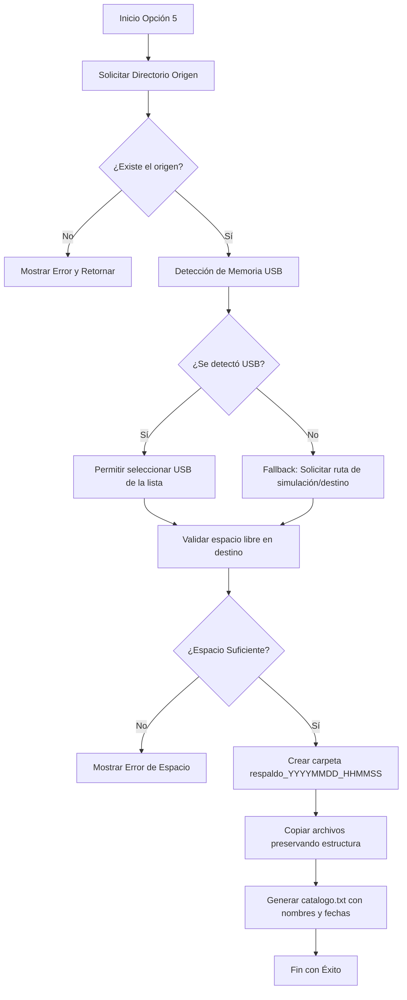

# DataCenterAdmin - Proyecto Final de Sistemas Operacionales

Este repositorio contiene las herramientas **DataCenterAdmin** desarrolladas en **Bash** y **PowerShell**. Su propósito es facilitar y automatizar diversas tareas administrativas fundamentales para el administrador de un centro de datos (Data Center) en entornos Linux y Windows.

---

##  Integrantes del Equipo y Distribución de Responsabilidades

| Integrante | Rol / Responsabilidades | Tareas Desarrolladas | Código Asignado |
| :--- | :--- | :--- | :--- |
| **Rodolfo Moreno**<br>(A00395543) | **Integrante 1**: Gestión de usuarios y almacenamiento | • Opción 1: Consulta de usuarios y último inicio de sesión.<br>• Opción 2: Información de almacenamiento y discos conectados (tamaño total y libre en bytes). | `get_system_users_last_login`<br>`get_disk_storage_info`<br>`GetSystemUsersLastLogin`<br>`GetDiskStorageInfo` |
| **Matthew Lane**<br>(A00399934) | **Integrante 2**: Gestión de archivos y monitoreo de memoria | • Opción 3: Búsqueda recursiva de los 10 archivos más grandes en una ruta especificada.<br>• Opción 4: Monitoreo de memoria RAM y Swap en uso (bytes y porcentaje). | `get_top10_largest_files`<br>`get_memory_and_swap_info`<br>`GetTop10LargestFiles`<br>`GetMemoryAndSwapInfo` |
| **Sebastian Cosme**<br>(A00399492) | **Integrante 3**: Sistema de respaldo, integración y documentación | • Opción 5: Sistema de copia de seguridad (Backup) a un dispositivo USB con validación de espacio y generación de catálogo de archivos.<br>• Integración general del Menú Principal interativo.<br>• Documentación y README final. | `perform_directory_backup`<br>`PerformDirectoryBackup`<br>Bucle de Menú en Bash y PowerShell |

---

##  Objetivos del Proyecto

1. **Automatización de Tareas de Administración**: Proveer una interfaz interactiva de consola para realizar diagnósticos rápidos del servidor (usuarios, almacenamiento, memoria y archivos grandes).
2. **Portabilidad Multiplataforma**: Ofrecer dos implementaciones funcionales equivalentes: una en **Bash** orientada a sistemas Linux/Unix y otra en **PowerShell** orientada a sistemas Windows.
3. **Respaldo Seguro y Verificable**: Implementar un sistema de respaldo confiable que calcule requerimientos de espacio en disco, copie archivos manteniendo la estructura original de carpetas, y genere un reporte (catálogo) con marcas de tiempo.

---

##  Requisitos de Instalación y Requisitos Previos

### Entorno Linux (Bash)
- **Sistema Operativo**: Distribución Linux (Ubuntu, Debian, CentOS, RHEL) o subsistema WSL en Windows.
- **Utilidades del Sistema**:
  - `awk`, `sed`, `df`, `find`, `cp` (comúnmente preinstalados).
  - `lsblk` y `lastlog` (para detección automática de USB y último login de usuarios).
- **Permisos**: Algunos comandos como `lastlog` o el análisis de directorios protegidos con `find` pueden requerir privilegios de superusuario (`sudo`).

### Entorno Windows (PowerShell)
- **Sistema Operativo**: Windows 10, Windows 11 o Windows Server.
- **Versión de PowerShell**: PowerShell 5.1 o superior.
- **Configuración de Ejecución**: Es necesario habilitar la ejecución de scripts locales mediante directiva de ejecución.
- **Permisos**: Ejecutar la terminal de PowerShell como **Administrador** para el correcto funcionamiento de cmdlets como `Get-LocalUser` o `Get-CimInstance`.

---

##  Instrucciones de Ejecución

### 1. Ejecución del script de Bash (`DataCenterAdmin.sh`)

Otorgue permisos de ejecución al script y láncelo:

```bash
chmod +x DataCenterAdmin.sh
./DataCenterAdmin.sh
```

*(Si se requiere auditar todos los usuarios del sistema, se recomienda ejecutar como superusuario: `sudo ./DataCenterAdmin.sh`)*.

### 2. Ejecución del script de PowerShell (`DataCenterAdmin.ps1`)

Abra una consola de PowerShell como administrador, navegue al directorio del proyecto y ejecute:

```powershell
Set-ExecutionPolicy -Scope Process -ExecutionPolicy Bypass
.\DataCenterAdmin.ps1
```

---

##  Descripción Detallada de las Opciones del Menú

Al ejecutar cualquiera de las herramientas, se desplegará un menú interactivo con las siguientes opciones:

### Opción 1: Usuarios del sistema y último login
- **Descripción**: Muestra los usuarios del sistema junto con la fecha y hora de su último ingreso (*login*).
- **Comportamiento en Bash**: Lee del archivo `/etc/passwd` filtrando usuarios con UID >= 1000 y el usuario `root`. Consulta los detalles con el comando `lastlog`.
- **Comportamiento en PowerShell**: Utiliza el cmdlet `Get-LocalUser` para listar cuentas locales indicando su estado (Activo/Inactivo) y la propiedad `LastLogon`.

### Opción 2: Filesystems o discos conectados (Tamaño y espacio libre)
- **Descripción**: Lista las unidades y sistemas de archivos montados, detallando su tamaño total y espacio disponible expresado rigurosamente en bytes.
- **Comportamiento en Bash**: Usa el comando `df -B1` omitiendo sistemas de archivos virtuales temporales (`tmpfs`, `devtmpfs`, etc.).
- **Comportamiento en PowerShell**: Consulta la clase WMI `Win32_LogicalDisk` para obtener información física de discos de tipo local o extraíble.

### Opción 3: Mostrar los 10 archivos más grandes en una ruta
- **Descripción**: Solicita al usuario una ruta de directorio, la analiza recursivamente, y muestra ordenados de mayor a menor los 10 archivos que más espacio ocupan en disco con su ruta absoluta y tamaño en bytes.
- **Comportamiento en Bash**: Ejecuta `find` con el parámetro `-printf` y ordena mediante `sort -rn`.
- **Comportamiento en PowerShell**: Ejecuta `Get-ChildItem -Recurse` y ordena los objetos resultantes por su propiedad `Length` de forma descendente.

### Opción 4: Monitoreo de memoria RAM y Swap (Bytes y porcentaje)
- **Descripción**: Muestra el diagnóstico de memoria RAM (total, libre, disponible) y la memoria de intercambio/paginación (*Swap*) expresando los valores en bytes y porcentajes de uso.
- **Comportamiento en Bash**: Analiza el archivo pseudo-filesystem `/proc/meminfo` mediante scripts de `awk`.
- **Comportamiento en PowerShell**: Utiliza la clase WMI `Win32_OperatingSystem` para la memoria RAM y `Win32_PageFileUsage` para los archivos de paginación del sistema.

### Opción 5: Copia de seguridad (Backup) a memoria USB
- **Descripción**: Solicita un directorio origen y realiza un respaldo del mismo en una unidad extraíble USB o en una ruta simulada.
- **Flujo de Trabajo**:
  1. **Validación del Origen**: Verifica que el directorio origen exista y tenga permisos de lectura.
  2. **Detección de USB**: Busca de forma automática dispositivos extraíbles montados. Si encuentra dispositivos, permite seleccionarlos; en caso contrario (o si se ejecuta en entornos como WSL sin montaje directo), activa un **mecanismo de fallback/simulación** para definir una ruta personalizada.
  3. **Cálculo de Espacio**: Mide el tamaño total del directorio origen y lo compara con el espacio libre disponible en el destino para prevenir fallos por falta de capacidad.
  4. **Copia Estructurada**: Crea una carpeta con la nomenclatura `respaldo_YYYYMMDD_HHMMSS` y copia todos los archivos conservando su estructura de directorios original.
  5. **Catálogo**: Genera un archivo de texto llamado `catalogo.txt` dentro de la carpeta respaldada que enumera todos los archivos copiados junto a su fecha de última modificación.

---

##  Pruebas de Funcionamiento y Evidencias

### Captura / Diagrama del Flujo de Respaldo (Opción 5)



---

*Proyecto desarrollado para el curso de Sistemas Operacionales, Facultad de Ingeniería, Diseño y Ciencias Aplicadas - Universidad ICESI.*
